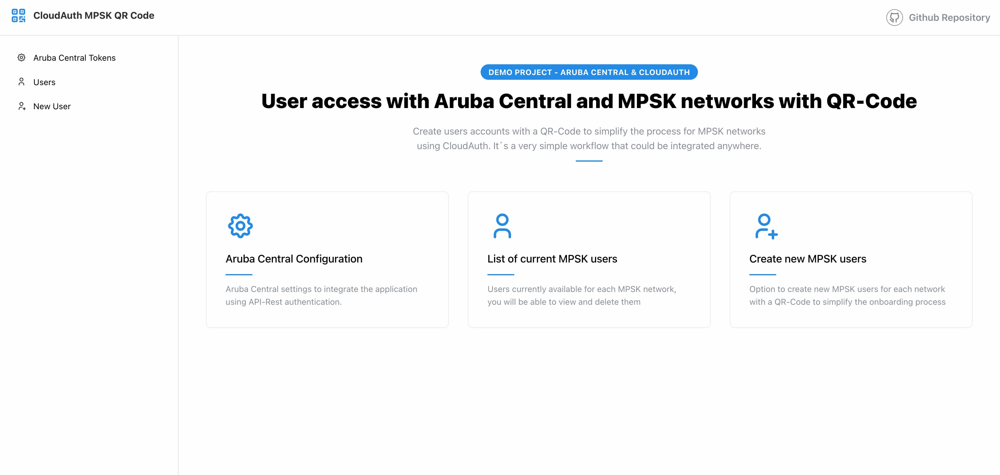
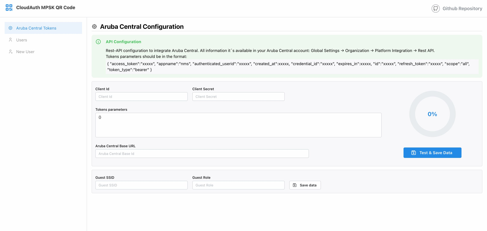
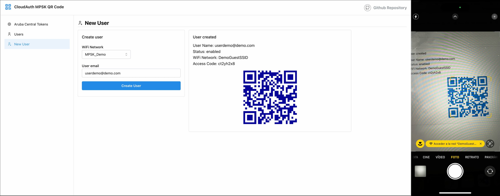

# CloudAuth MPSK QR-Code

This is a demo-project of integration with Aruba Central to generate users using CloudAuth with MPSK and a QR Code.
Aruba Central allow you to create a MPSK SSID and every user will have a custom PSK and it will be easy to connect with a QR Code.

## Current options

- Configuration of Aruba Central integration with Rest-API parameters.
- Create users to the MPSK option in CloudAuth.
- Delete users created before.

## Getting Started

The code is not finished, it's an example that could be use for everyone.
It's a Next-JS project, so you only need to clone the project and use it on-prem.

Open [http://localhost:3000](http://localhost:3000) with your browser to see the result.

In the menu Aruba Central Token you will need to write:

- Client Id
- Secret Id
- Tokens (it needs to be the full json code exported by Aruba Central in the "Download Token" option)
- Configure your Aruba Central Base URL (like: https://xxxxx-apigw.central.arubanetworks.com)
- Configure the desired SSID name
- Configure the desired default Role

## To-Be done

The code could be improved with more error handilings. There are other things to do, for example:

- [ ] The SSID could be read from Aruba Central (currently it's manual).
- [ ] User Roles could be read from Aruba Central, avoiding typos in the field.
- [ ] Auto-refresh tokens while you are in the page. It would be implemented in the middleware file.
